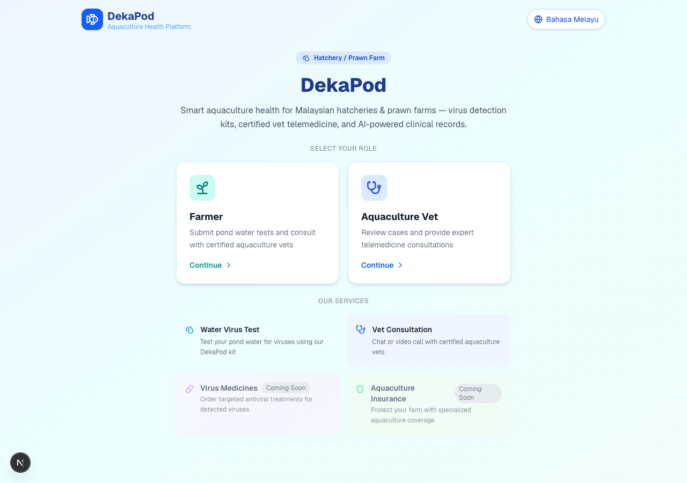

# DekaPod — Aquaculture Health Platform

> **Platform Kesihatan Akuakultur** | Smart aquaculture health for Malaysian hatcheries and prawn farms.



DekaPod connects prawn farmers with certified aquaculture vets through telemedicine. Farmers test their pond water using a colour-change kit, submit the result, and consult a vet via text chat or video call. Every session ends with an **AI-generated clinical transcript** for farm records.

---

## Features

| Feature | Status |
|---|---|
| Water virus test — colour picker + photo upload | ✅ Live |
| Aquaculture vet telemedicine (text chat + video call) | ✅ Live |
| AI-generated clinical transcript (Claude Haiku) | ✅ Live |
| Bilingual — English & Bahasa Melayu | ✅ Live |
| Virus Medicines ordering | 🔜 Coming Soon |
| Aquaculture Insurance | 🔜 Coming Soon |

---

## Docker Setup

### Prerequisites

- [Docker](https://docs.docker.com/get-docker/) and [Docker Compose](https://docs.docker.com/compose/install/) installed
- An [Anthropic API key](https://console.anthropic.com/) for AI transcript generation

### Quick Start

```bash
# 1. Clone the repository
git clone https://github.com/touhidulai/DekaPod.git
cd DekaPod

# 2. Set your API key
echo "ANTHROPIC_API_KEY=sk-ant-your-key-here" > .env.local

# 3. Build and run
docker compose up --build

# 4. Open the app
# http://localhost:3000
```

### Run in Background

```bash
docker compose up --build -d

# View logs
docker compose logs -f

# Stop
docker compose down
```

### Build Image Only

```bash
docker build -t dekapod .
docker run -p 3000:3000 -e ANTHROPIC_API_KEY=sk-ant-your-key-here dekapod
```

The Docker image uses a **3-stage build** (deps → builder → runner) with Next.js `standalone` output for a minimal production image.

---

## Local Development

```bash
# Install dependencies
npm install

# Copy environment file
cp env.example .env.local
# Edit .env.local and add your ANTHROPIC_API_KEY

# Start development server
npm run dev
```

Open [http://localhost:3000](http://localhost:3000).

---

## Environment Variables

| Variable | Description | Required |
|---|---|---|
| `ANTHROPIC_API_KEY` | Anthropic API key for AI transcript generation | Yes |

Copy `env.example` to `.env.local` and fill in your values.

---

## Tech Stack

- **Framework:** Next.js 14 (App Router)
- **Styling:** Tailwind CSS
- **AI:** Anthropic Claude Haiku (via `@anthropic-ai/sdk`)
- **Video Calls:** Jitsi Meet (no API key required)
- **State:** localStorage with 2-second polling for real-time chat
- **Container:** Docker (multi-stage, `node:22-alpine`)

---

## Project Structure

```
├── app/
│   ├── api/transcript/     # Claude AI transcript endpoint
│   ├── farmer/             # Farmer pages (dashboard, test, consult)
│   └── vet/                # Vet pages (dashboard, consult)
├── components/
│   ├── ConsultationRoom    # Shared chat + video + transcript UI
│   ├── ColorPicker         # Kit colour selection grid
│   ├── Header              # Nav with language toggle + logout
│   └── RiskBadge           # Risk level pill badge
├── lib/
│   ├── colors.ts           # Kit colour definitions & risk config
│   ├── i18n.ts             # EN / BM translations
│   ├── store.ts            # localStorage data store
│   └── types.ts            # TypeScript interfaces
├── Dockerfile
└── docker-compose.yml
```

---

## How It Works

1. **Farmer** selects a kit colour result after dipping the test strip into pond water
2. Farmer optionally uploads a photo and adds notes, then requests a vet consultation
3. **Vet** sees the pending case on their dashboard and joins the consultation
4. Both parties chat (text) or join a Jitsi video call via a shared link
5. Vet clicks **Generate AI Transcript** — Claude Haiku produces a structured clinical report in the chosen language
6. Transcript is saved to the consultation record for future reference
